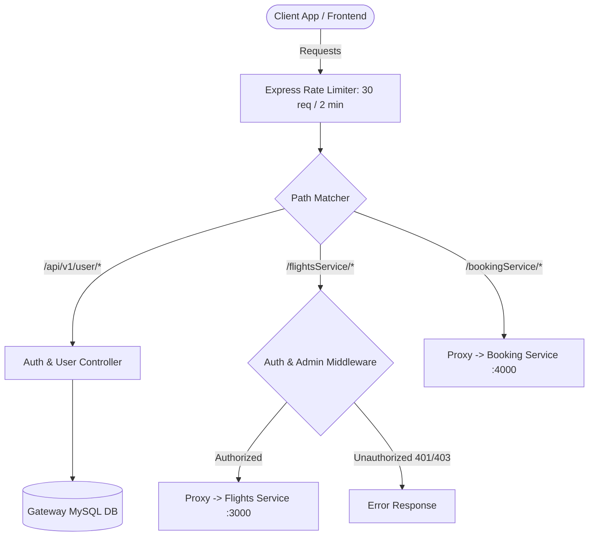

# API Gateway & Authentication Service (`API_Gateway_Flights`)

The **API Gateway & Authentication Service** is the central entry point and security perimeter for the Distributed Flight Service system. It acts as a reverse proxy, authenticates users, manages Role-Based Access Control (RBAC), enforces rate limits, and routes inbound client traffic to the internal downstream microservices.

---

## 1. Tech Stack & Dependencies

- **Runtime & Framework:** Node.js (v18+), Express.js (`^5.2.1`)
- **Reverse Proxy:** `http-proxy-middleware` (`^3.0.7`)
- **Authentication & Security:** 
  - `jsonwebtoken` (`^9.0.3`) for JWT generation and verification
  - `bcrypt` (`^6.0.0`) for cryptographic password hashing
  - `express-rate-limit` (`^8.6.2`) for DDoS and brute-force mitigation
- **ORM & Database:** Sequelize (`^6.37.8`), `sequelize-cli` (`^6.6.5`), MySQL (`mysql2` `^3.22.5`)
- **Logging & Utilities:** Winston (`^3.19.0`), `http-status-codes` (`^2.3.0`), `dotenv` (`^17.4.2`)

---

## 2. Architectural Role & Flow

The API Gateway is mounted on Port `5000` and serves two primary purposes:
1. **Identity Provider (IdP):** Manages user registration, login, JWT token issuance, and role assignments.
2. **Reverse Proxy & Traffic Controller:** Inspects incoming client requests, verifies JWT credentials and administrative roles, applies IP rate limits, and forwards requests to:
   - **Flights Service** (`http://localhost:3000`)
   - **Flight Booking Service** (`http://localhost:4000`)



---

## 3. Environment Variables

Create a `.env` file in the root of `API_Gateway_Flights/`:

```env
PORT=5000
SALT_ROUNDS=8
JWT_SECRET=your_jwt_secret_key_here
JWT_EXPIRY=1h
FLIGHT_SERVICE=http://localhost:3000
BOOKING_SERVICE=http://localhost:4000
```

### Database Configuration (`src/config/config.json`)
```json
{
  "development": {
    "username": "root",
    "password": "your_db_password",
    "database": "Flight_Gateway_Dev",
    "host": "127.0.0.1",
    "dialect": "mysql"
  }
}
```

---

## 4. Database Models & Schema

The service manages user identities and permissions across three tables:

### 1. `Users`
- `id` (INT, Primary Key, Auto Increment)
- `email` (STRING, Unique, Required, Valid Email format)
- `password` (STRING, Required, 3–50 chars, auto-hashed via bcrypt `beforeCreate` hook)
- `createdAt` / `updatedAt` (DATETIME)

### 2. `Roles`
- `id` (INT, Primary Key, Auto Increment)
- `name` (STRING, Required, Values: `'admin'`, `'customer'`, `'flight_company'`)
- `createdAt` / `updatedAt` (DATETIME)

### 3. `User_Roles` (Junction Table)
- `id` (INT, Primary Key, Auto Increment)
- `userId` (INT, Foreign Key -> `Users.id`)
- `roleId` (INT, Foreign Key -> `Roles.id`)
- `createdAt` / `updatedAt` (DATETIME)

---

## 5. Security & Middlewares

### Rate Limiting
- Configured using `express-rate-limit` globally:
  - **Window:** 2 minutes (`120,000 ms`)
  - **Max Requests:** 30 requests per IP per window

### Authentication & Authorization Pipeline
1. **`validateAuthRequest`:** Ensures `email` and `password` are present in `req.body`.
2. **`checkAuth`:**
   - Reads `x-access-token` header.
   - Verifies JWT validity and expiry using `JWT_SECRET`.
   - Fetches user from DB and assigns `req.user = user.id`.
3. **`isAdmin`:**
   - Checks if `req.user` holds the `'admin'` role in `User_Roles`.
   - Returns `401 Unauthorized` if not an admin.

### Gateway-Protected Proxy Routes
The gateway protects sensitive downstream flight management operations directly at the gateway layer:
- `POST /flightsService/api/v1/flights` $\rightarrow$ `checkAuth` + `isAdmin`
- `PATCH /flightsService/api/v1/flights/:id/seats` $\rightarrow$ `checkAuth` + `isAdmin`

---

## 6. API Route Catalog & Endpoints

### Direct Gateway Endpoints

#### 1. User Sign Up
- **Method & Route:** `POST /api/v1/user/signup`
- **Access:** Public
- **Description:** Registers a new user. Automatically hashes the password and assigns the default `customer` role.
- **Request Body:**
```json
{
  "email": "user@example.com",
  "password": "StrongPassword123"
}
```
- **Success Response (`201 Created`):**
```json
{
  "success": true,
  "message": "Successfully completed the request",
  "data": {
    "id": 1,
    "email": "user@example.com"
  },
  "error": {}
}
```
- **Error Responses:**
  - `400 Bad Request`: Missing email or password, or email already registered.

---

#### 2. User Sign In
- **Method & Route:** `POST /api/v1/user/signin`
- **Access:** Public
- **Description:** Verifies credentials and generates a signed JWT token valid for 1 hour.
- **Request Body:**
```json
{
  "email": "user@example.com",
  "password": "StrongPassword123"
}
```
- **Success Response (`201 Created`):**
```json
{
  "success": true,
  "message": "Successfully completed the request",
  "data": "eyJhbGciOiJIUzI1NiIsInR5cCI6IkpXVCJ9...",
  "error": {}
}
```
- **Error Responses:**
  - `400 Bad Request`: Invalid password or missing credentials.
  - `404 Not Found`: No user found with the specified email.

---

#### 3. Assign Role to User
- **Method & Route:** `POST /api/v1/user/role`
- **Access:** Private (Admin only)
- **Headers:** `x-access-token: <ADMIN_JWT_TOKEN>`
- **Description:** Assigns an elevated role (`admin`, `flight_company`, `customer`) to a target user.
- **Request Body:**
```json
{
  "role": "admin",
  "id": 2
}
```
- **Success Response (`201 Created`):**
```json
{
  "success": true,
  "message": "Successfully completed the request",
  "data": {
    "id": 2,
    "email": "operator@airline.com"
  },
  "error": {}
}
```
- **Error Responses:**
  - `400 Bad Request`: Invalid token or missing payload.
  - `401 Unauthorized`: Calling user is not an administrator.
  - `404 Not Found`: Target user ID or role name not found.

---

#### 4. Service Version Check
- **Method & Route:** `GET /api/v2/info`
- **Access:** Public
- **Response (`200 OK`):**
```json
{
  "message": "coming from v2 api"
}
```

---

### Reverse Proxy Routes (Forwarded to Downstream Services)

| Gateway Path | Forwarded Target | Auth / Guards | Downstream Service |
|---|---|---|---|
| `POST /flightsService/api/v1/flights` | `http://localhost:3000/api/v1/flights` | `checkAuth`, `isAdmin` | Flights Service |
| `PATCH /flightsService/api/v1/flights/:id/seats` | `http://localhost:3000/api/v1/flights/:id/seats` | `checkAuth`, `isAdmin` | Flights Service |
| `ALL /flightsService/*` | `http://localhost:3000/*` | Public / Pass-through | Flights Service |
| `ALL /bookingService/*` | `http://localhost:4000/*` | Pass-through | Flight Booking Service |

---

## 7. Setup & Execution

### 1. Install Dependencies
```bash
cd API_Gateway_Flights
npm install
```

### 2. Run Database Migrations & Seed Default Roles
```bash
# Run migrations to create users, roles, user_roles tables
npx sequelize db:migrate

# Seed roles (if seeders are configured) or insert default roles directly into MySQL:
# INSERT INTO Roles (name, createdAt, updatedAt) VALUES ('admin', NOW(), NOW()), ('customer', NOW(), NOW()), ('flight_company', NOW(), NOW());
```

### 3. Start Development Server
```bash
npm run dev
```
The server starts on `http://localhost:5000`.